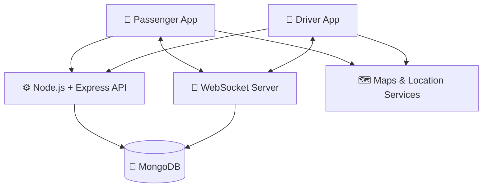
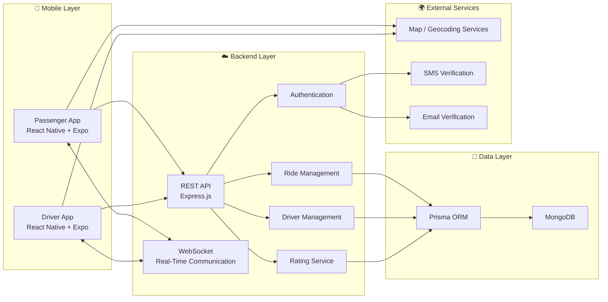
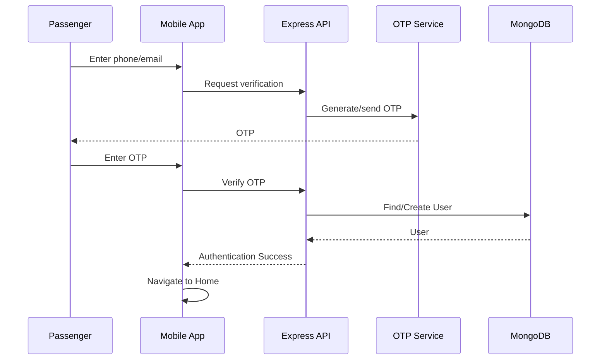
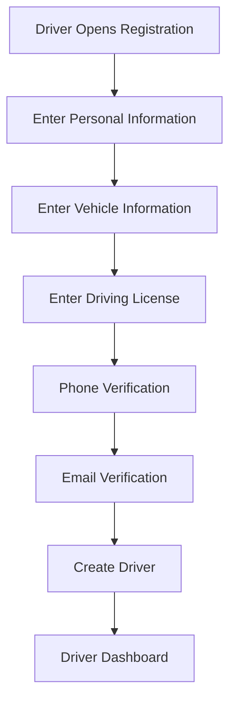
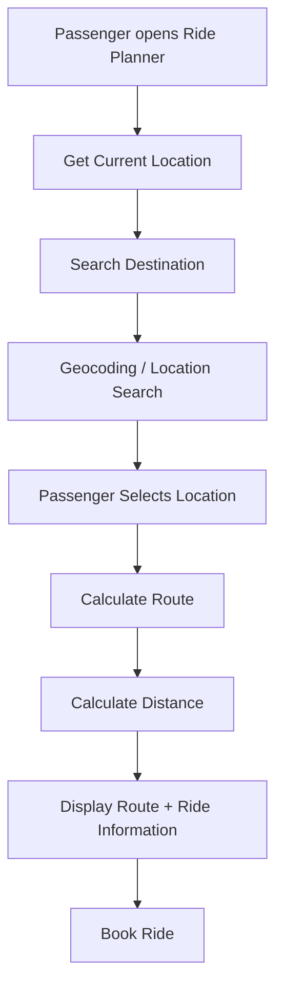
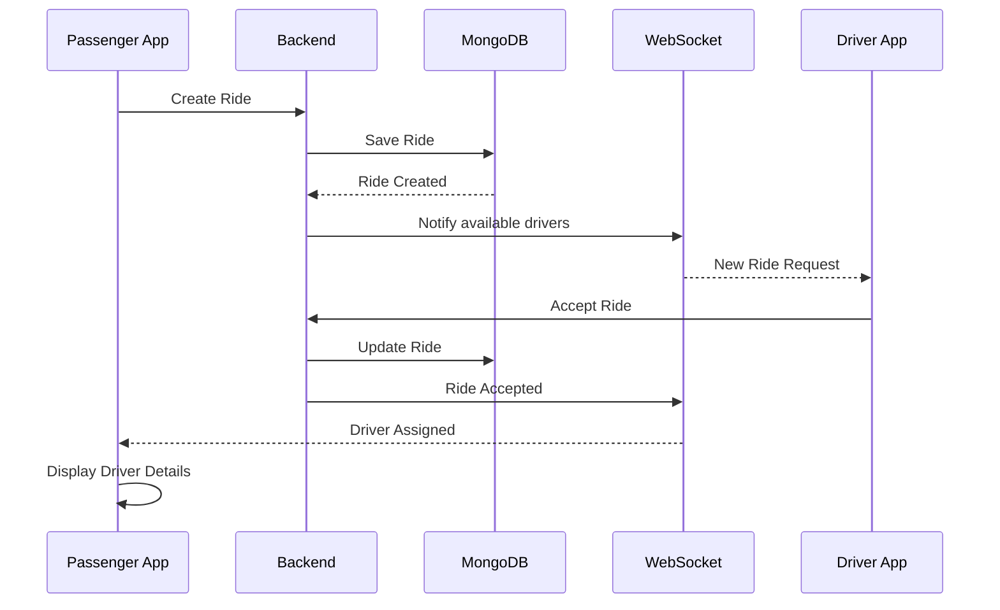
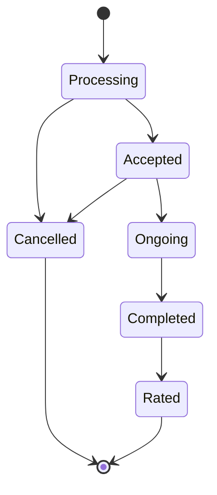
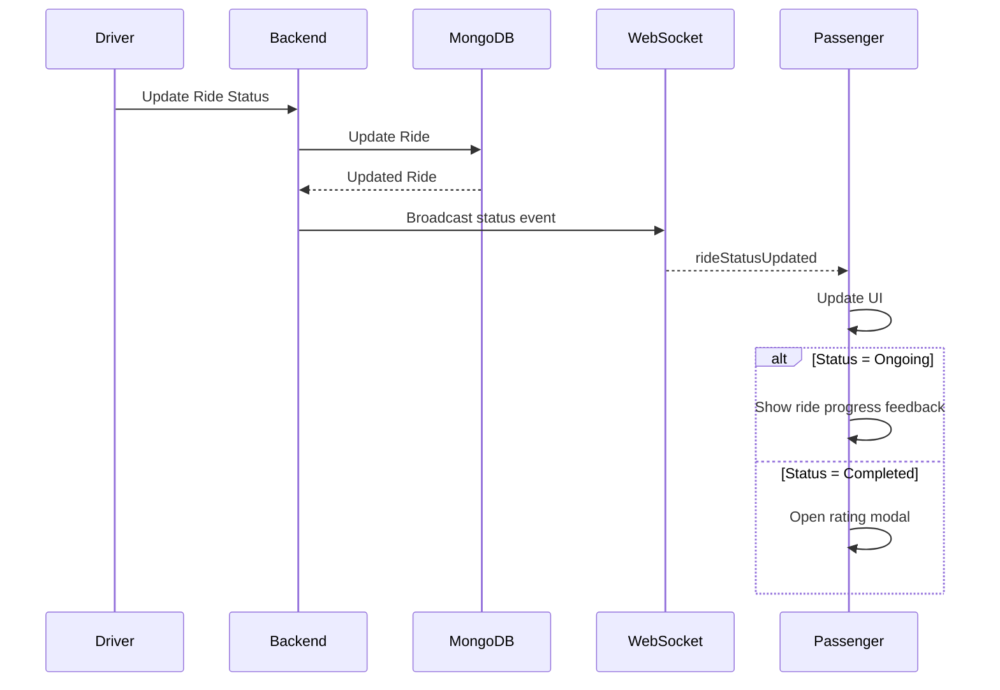
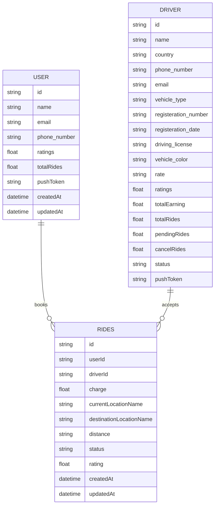

# 🚕 Rawaan — Ride-Sharing & Mobility Platform

> A modern real-time ride-booking platform built with React Native, Expo, Node.js, Express, Prisma, MongoDB and WebSockets.

Rawaan is a full-stack ride-sharing application designed to connect passengers with drivers through a real-time ride-booking system.

The application provides separate experiences for **Passengers** and **Drivers**, allowing passengers to search for destinations, request rides, monitor ride status in real time, communicate with drivers, complete rides and rate drivers.

The project focuses on building a scalable mobile architecture with real-time communication, location-based services, REST APIs, database persistence and a modern mobile UI.

---

# 📱 Project Overview

Rawaan consists of two primary mobile applications:



### Passenger Application

Passengers can:

* Create an account
* Authenticate using phone/email verification
* Search for pickup and destination locations
* View locations on a map
* Calculate route information
* Request rides
* Receive real-time ride status updates
* View driver information
* Contact their driver
* Track ride progress
* View fare information
* Select payment method
* Receive ride completion feedback
* Rate their driver
* View recent rides

### Driver Application

Drivers can:

* Register their profile
* Provide vehicle information
* Manage availability/status
* Receive ride requests
* Accept rides
* Update ride status
* Complete rides
* Track earnings
* Track ride statistics
* Maintain their driver rating
* Manage their profile

---

# 🎯 Problem Statement

Traditional ride-booking systems require multiple independent services to work together:

```text
Passenger
   │
   ├── Authentication
   ├── Location Search
   ├── Maps
   ├── Driver Matching
   ├── Ride Booking
   ├── Real-Time Status
   ├── Payment
   └── Rating
           │
           ▼
        Backend
           │
           ▼
        Database
```

The challenge was to build a system where these components communicate reliably while maintaining a responsive mobile experience.

The main engineering challenges include:

* Real-time communication
* Location handling
* Ride state management
* Driver/passenger synchronization
* Database consistency
* Authentication
* Mobile navigation
* API communication
* Map rendering
* Rating calculations
* Error handling
* Production deployment

---

# 🏗️ High-Level Architecture



---

# 🧰 Technology Stack

## Frontend

| Technology              | Purpose                                  |
| ----------------------- | ---------------------------------------- |
| React Native            | Cross-platform mobile development        |
| Expo                    | React Native development/build ecosystem |
| Expo Router             | File-based navigation                    |
| TypeScript              | Static typing                            |
| Axios                   | HTTP API communication                   |
| React Native Maps       | Map rendering                            |
| Expo Location           | Device location                          |
| WebSocket               | Real-time ride updates                   |
| Ionicons / custom icons | UI icons                                 |
| Custom Theme System     | Consistent UI                            |

---

## Backend

| Technology    | Purpose                 |
| ------------- | ----------------------- |
| Node.js       | JavaScript runtime      |
| Express.js    | REST API framework      |
| TypeScript    | Backend type safety     |
| Prisma        | ORM/database access     |
| MongoDB       | Primary database        |
| WebSocket     | Real-time communication |
| Twilio Verify | Phone verification      |
| Email service | Email OTP/verification  |

---

## Mapping

The application uses a map/location architecture consisting of:

```text
Location
   │
   ├── Device GPS
   │
   ├── Location Search
   │
   ├── Geocoding
   │
   ├── Route Calculation
   │
   └── Map Rendering
```

Depending on the configured environment, the project can use services such as:

* MapTiler
* OpenStreetMap
* Nominatim
* OSRM
* Device GPS

---

# 🔐 Authentication Flow

The authentication architecture is designed around verification before allowing access to protected functionality.



The same principle can be applied to driver registration.

---

# 🚗 Driver Registration Flow



Driver information includes:

* Name
* Country
* Phone number
* Email
* Vehicle type
* Registration number
* Registration date
* Driving license
* Vehicle color
* Rate

---

# 📍 Location Search Flow

A passenger begins a ride by selecting locations.



---

# 🗺️ Route Calculation

The route pipeline is conceptually:

```text
Pickup Coordinates
        │
        ▼
Destination Coordinates
        │
        ▼
Routing Service
        │
        ▼
Route Geometry
        │
        ▼
Polyline Coordinates
        │
        ▼
React Native Map
```

The route is then rendered on the map using a polyline.

---

# 🚕 Ride Booking Architecture

When a passenger books a ride:



---

# 🔄 Ride Lifecycle

A ride moves through several states.



The exact state names should remain consistent between frontend and backend.
---

# 🔌 Real-Time WebSocket Architecture

REST APIs handle persistent operations while WebSockets handle events that need immediate delivery.

```text
                  ┌─────────────────┐
                  │   WebSocket     │
                  │     Server      │
                  └────────┬────────┘
                           │
             ┌─────────────┴─────────────┐
             │                           │
             ▼                           ▼
       Passenger App               Driver App
             │                           │
             │                           │
       Ride Updates                Ride Updates
       Driver Updates              New Requests
       Completion                  Status Changes
```

Example event:

```json
{
  "type": "rideStatusUpdated",
  "rideId": "ride_id",
  "status": "Ongoing"
}
```

Passenger receives:

```text
Processing
     ↓
Accepted
     ↓
Ongoing
     ↓
Completed
```

---

# 📡 Ride Status Update Flow



---

# 💾 Database Architecture

Rawaan uses MongoDB with Prisma.



---

# 🗃️ Core Database Models

## User

```text
User
├── id
├── name
├── email
├── phone_number
├── ratings
├── pushToken
├── totalRides
├── createdAt
└── updatedAt
```

## Driver

```text
Driver
├── id
├── name
├── country
├── phone_number
├── email
├── vehicle_type
├── registeration_number
├── registeration_date
├── driving_license
├── vehicle_color
├── rate
├── ratings
├── totalEarning
├── totalRides
├── pendingRides
├── cancelRides
├── status
├── pushToken
├── createdAt
└── updatedAt
```

## Ride

```text
Rides
├── id
├── userId
├── driverId
├── charge
├── currentLocationName
├── destinationLocationName
├── distance
├── status
├── rating
├── createdAt
└── updatedAt
```

---


# 📞 Driver Communication

Passengers can access the driver's phone number from the ride details.

The mobile application can initiate:

```text
Passenger
    ↓
Ride Details
    ↓
Call Driver
    ↓
Android/iOS Phone Dialer
```

The app does not need to directly manage the phone call itself.

---

# 🧠 Engineering Decisions

## Why React Native?

One codebase can target:

```text
Android
iOS
```

while still providing access to native device capabilities.

## Why Expo?

Expo simplifies:

* Development
* Native configuration
* Builds
* Device testing
* App distribution

## Why Node.js?

Node.js is suitable for:

* REST APIs
* Real-time communication
* I/O-heavy workloads
* JavaScript/TypeScript ecosystem

## Why Prisma?

Prisma provides:

* Type-safe database queries
* Schema management
* Cleaner database access
* Better developer experience

## Why MongoDB?

MongoDB provides a flexible document-oriented data model suitable for rapidly evolving application data.

## Why WebSockets?

Ride status is time-sensitive.

Polling would require:

```text
Request
Wait
Request
Wait
Request
Wait
```

WebSockets allow:

```text
Server ───────────────► Client
        instant event
```

This provides a better real-time experience.


---

# 🏆 Key Features

## Passenger Features

* Authentication
* OTP verification
* Profile management
* Current location detection
* Location search
* Destination selection
* Route visualization
* Distance calculation
* Fare calculation
* Ride booking
* Driver assignment
* Driver information
* Driver calling
* Real-time ride status
* Ride completion
* Driver rating
* Ride history
* Recent rides
* Payment interface

## Driver Features

* Driver registration
* Vehicle registration
* License information
* Driver profile
* Driver availability
* Ride request handling
* Ride acceptance
* Ride status updates
* Ride completion
* Earnings tracking
* Ride statistics
* Rating management

## Backend Features

* REST API
* Prisma ORM
* MongoDB
* Ride management
* Driver management
* User management
* Rating system
* OTP verification
* WebSocket communication
* Server-side validation
* Error handling

---

# 🧠 Lessons Learned

This project provided practical experience with:

### React Native

* Component architecture
* Expo Router
* Native permissions
* Maps
* Device location
* Production builds

### Backend

* REST APIs
* Express controllers
* Authentication
* Database relationships
* Prisma
* MongoDB

### Real-Time Systems

* WebSocket connections
* Event-driven architecture
* Ride status synchronization
* Reconnection handling

### Software Engineering

* Separation of concerns
* API design
* State management
* Validation
* Error handling
* Production debugging
* Environment configuration

---
