# Rawaan — Real-Time Ride-Sharing & Mobility Platform

> A modern full-stack ride-sharing platform built with **React Native, Expo, Node.js, Express, Prisma, MongoDB and WebSockets**, featuring real-time ride updates and live driver tracking.

Rawaan is a full-stack mobile ride-booking platform designed to connect **passengers and drivers through a real-time ride lifecycle**.

Passengers can search for destinations, request rides, receive driver assignments, track their driver's location in real time, monitor ride progress, contact drivers, view fare information, complete rides and submit ratings.

Drivers have a dedicated application where they can register, manage their availability, receive ride requests, accept rides, update ride status, share their live location and track their ride statistics and earnings.

---

# Screenshots

### Passenger App

<p align="center">
  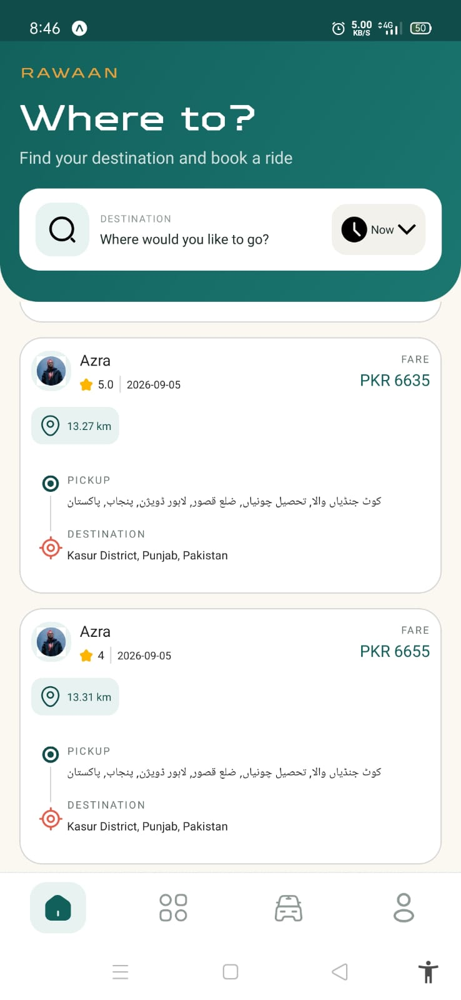
  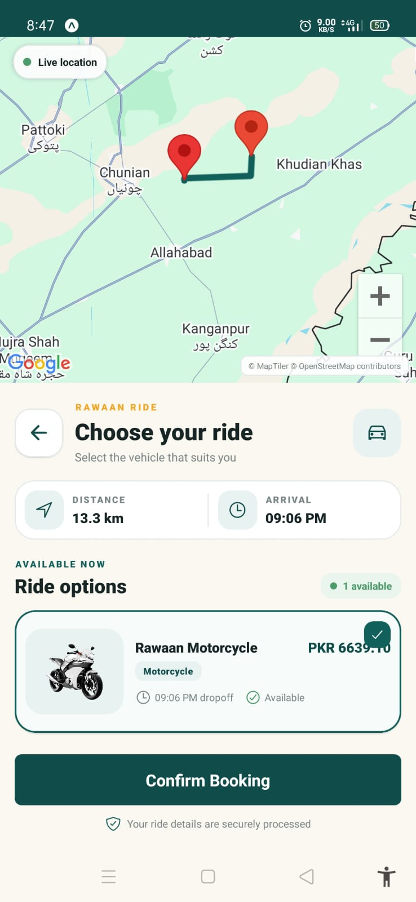
  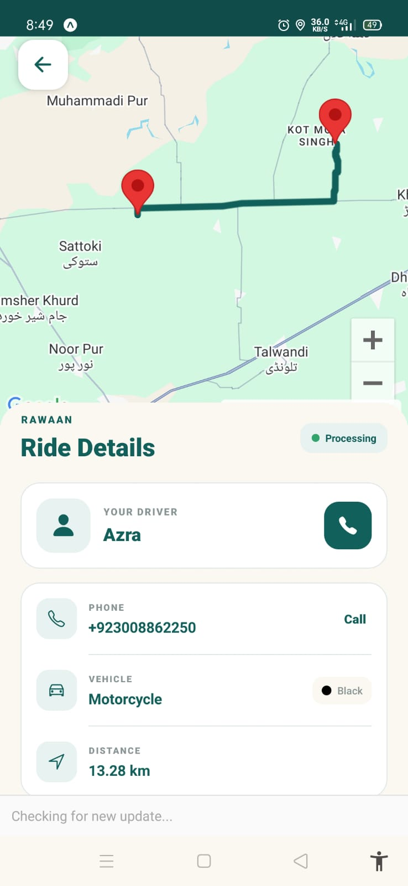
</p>

<p align="center">
  <b>Passenger Home</b> &nbsp;&nbsp;&nbsp;
  <b>Ride Planner</b> &nbsp;&nbsp;&nbsp;
  <b>Live Driver Tracking</b>
</p>

###  Driver App

<p align="center">
  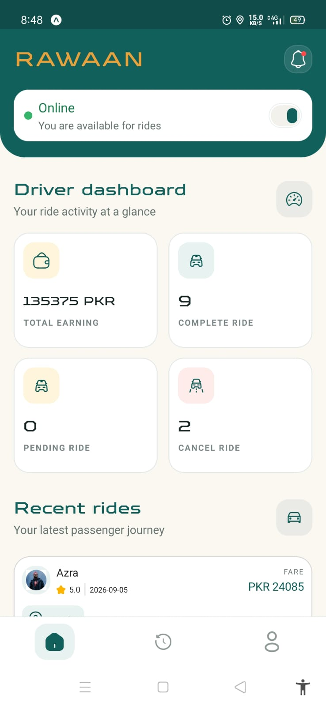
  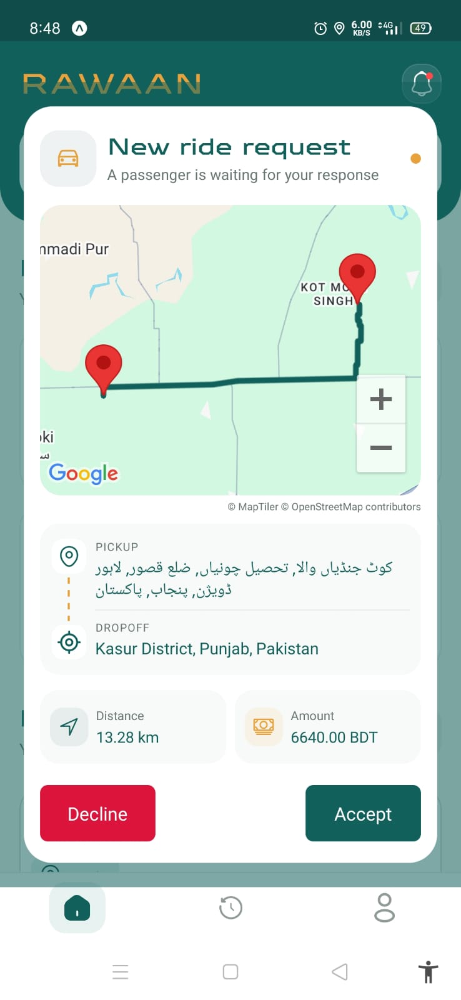
  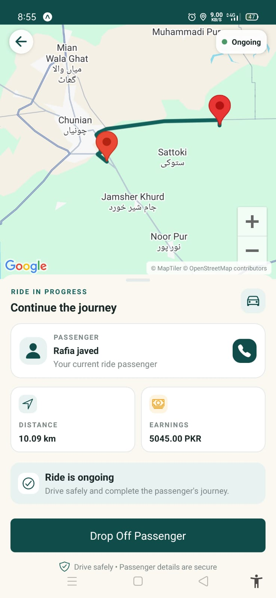
</p>

<p align="center">
  <b>Driver Dashboard</b> &nbsp;&nbsp;&nbsp;
  <b>Ride Request</b> &nbsp;&nbsp;&nbsp;
  <b>Active Ride</b>
</p>

### Ride Completion

<p align="center">
  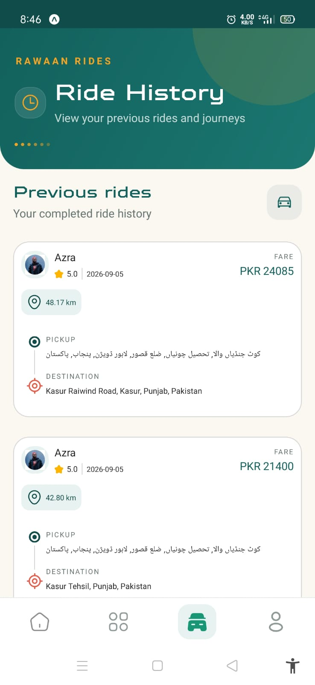
  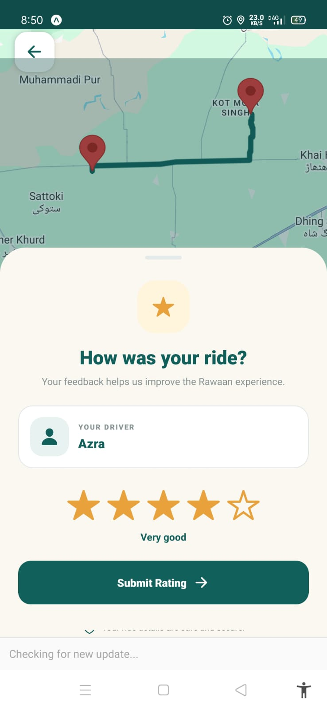
</p>

---

#  Project Overview

Rawaan consists of two primary mobile applications:

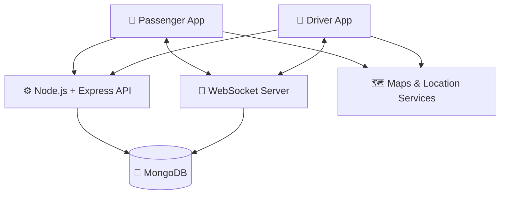

### Passenger Application

Passengers can:

* Create an account
* Verify their phone/email
* Manage their profile
* Detect their current location
* Search for locations
* Select pickup and destination
* View routes on a map
* Calculate distance
* Calculate/view fare information
* Request rides
* Receive driver assignments
* View driver information
* Call their driver
* Track the driver in real time
* Receive real-time ride status updates
* Monitor ride progress
* Complete rides
* Rate drivers
* View recent rides and ride history
* Select a payment method

### Driver Application

Drivers can:

* Register their driver profile
* Provide vehicle information
* Provide license information
* Manage availability
* Receive ride requests
* Accept rides
* Update ride status
* Share their current location
* Navigate toward passengers
* Complete rides
* Track earnings
* View ride statistics
* Maintain their driver rating
* Manage their profile

---

# Key Feature — Real-Time Driver Tracking

One of the core features of Rawaan is **real-time driver location tracking**.

After a driver accepts a ride, the driver's mobile application can continuously provide location updates while the ride is active.

The passenger receives these updates through the WebSocket connection and updates the driver's marker on the map.

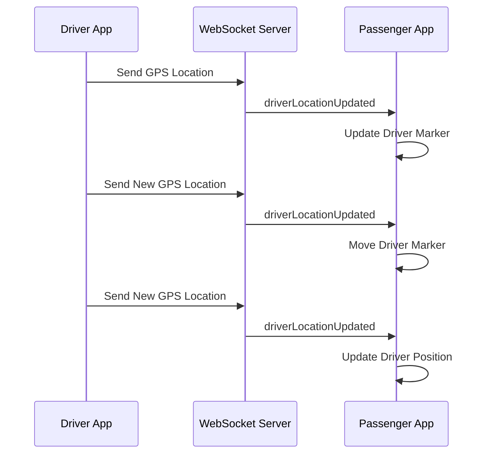

Conceptually:

```text
Driver GPS
    │
    ▼
Driver Application
    │
    │ WebSocket
    ▼
WebSocket Server
    │
    │ Real-Time Event
    ▼
Passenger Application
    │
    ▼
Update Driver Marker
```

Example event:

```json
{
  "type": "driverLocationUpdated",
  "rideId": "ride_id",
  "driverId": "driver_id",
  "latitude": 31.5204,
  "longitude": 74.3587
}
```

This allows the passenger to see the driver's movement instead of relying on periodic polling.

---

# Complete Ride Lifecycle

The complete Rawaan ride lifecycle is:

```text
Passenger Opens App
        │
        ▼
Select Pickup Location
        │
        ▼
Select Destination
        │
        ▼
Preview Route / Fare
        │
        ▼
Request Ride
        │
        ▼
Available Driver Receives Request
        │
        ▼
Driver Accepts
        │
        ▼
Passenger Receives Driver Information
        │
        ▼
Live Driver Tracking Starts
        │
        ▼
Driver Travels Toward Pickup
        │
        ▼
Driver Reaches Passenger
        │
        ▼
Ride Starts
        │
        ▼
Live Ride Tracking
        │
        ▼
Driver Reaches Destination
        │
        ▼
Ride Completed
        │
        ▼
Passenger Rates Driver
```

---

# Ride State Management

A ride progresses through controlled states:

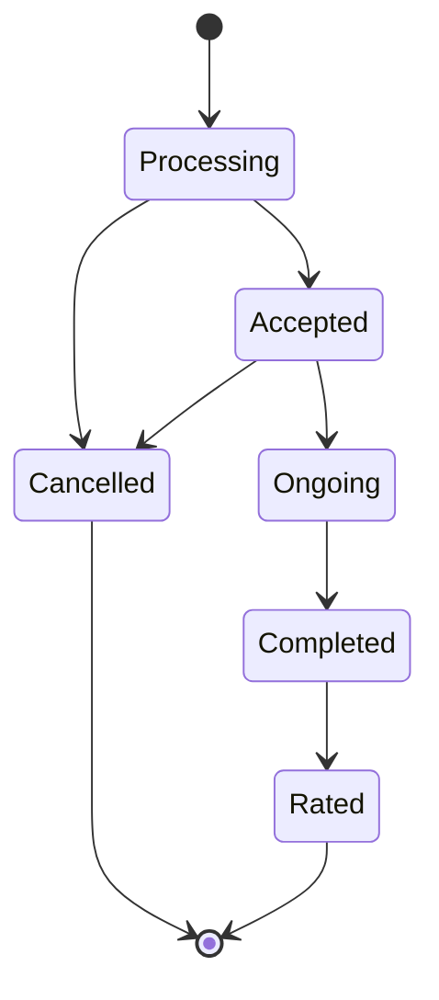

### Ride States

| State        | Description                              |
| ------------ | ---------------------------------------- |
| `Processing` | Ride request has been created            |
| `Accepted`   | A driver has accepted the ride           |
| `Ongoing`    | Driver/passenger are actively travelling |
| `Completed`  | Ride has reached its destination         |
| `Rated`      | Passenger has submitted a rating         |
| `Cancelled`  | Ride has been cancelled                  |

Keeping ride states synchronized between the backend and both mobile applications is an important part of the architecture.

---

# Real-Time WebSocket Architecture

REST APIs are used for persistent operations, while WebSockets are used for events that require immediate synchronization.

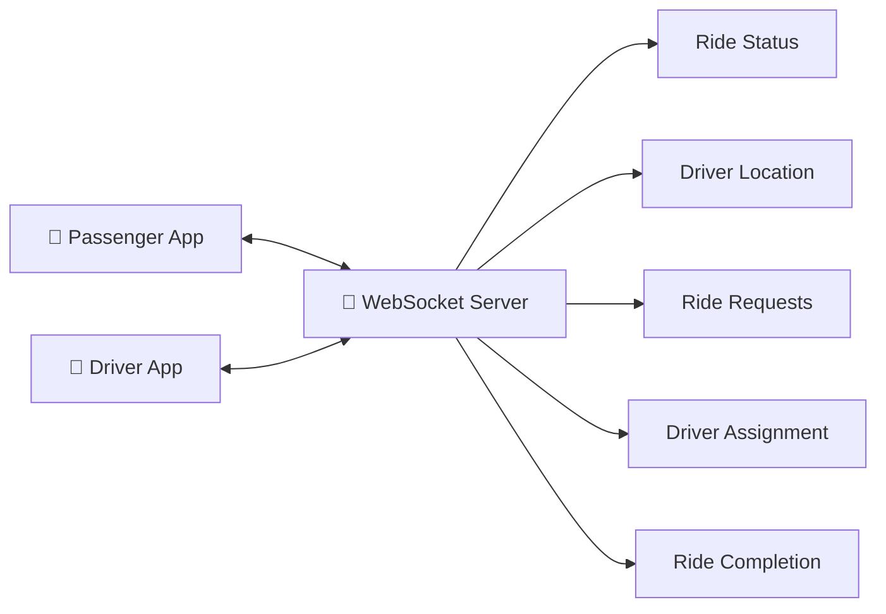

### Real-Time Events

Examples of real-time events include:

```text
newRideRequest
       ↓
rideAccepted
       ↓
driverAssigned
       ↓
driverLocationUpdated
       ↓
rideStatusUpdated
       ↓
rideCompleted
```

Example ride status event:

```json
{
  "type": "rideStatusUpdated",
  "rideId": "ride_id",
  "status": "Ongoing"
}
```

Example driver location event:

```json
{
  "type": "driverLocationUpdated",
  "rideId": "ride_id",
  "driverId": "driver_id",
  "latitude": 31.5204,
  "longitude": 74.3587
}
```

---

# Driver Location Flow

The driver's GPS location is used throughout the active ride.

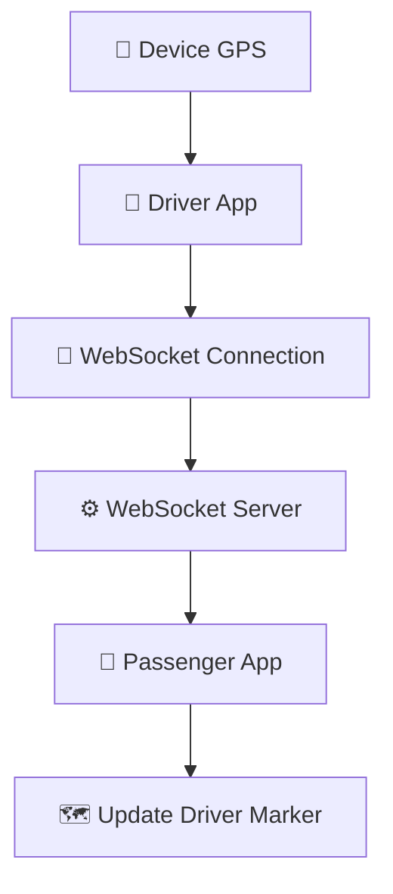

This architecture allows the passenger's map to react to driver movement in near real time.

---

# Ride Booking Architecture

When a passenger requests a ride:

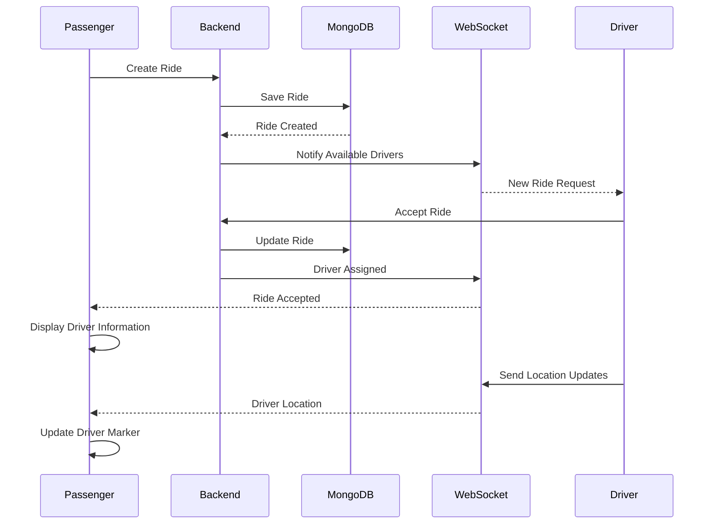

---

# Location & Route Architecture

Rawaan uses device GPS, location search, geocoding and routing services to create the ride planning experience.

```text
                  Device GPS
                      │
                      ▼
               Current Location
                      │
                      ▼
              Location Search
                      │
                      ▼
                 Destination
                      │
                      ▼
                Route Service
                      │
            ┌─────────┴─────────┐
            ▼                   ▼
        Distance             Route
            │                   │
            └─────────┬─────────┘
                      ▼
                 Ride Preview
                      │
                      ▼
                  Book Ride
```

The route pipeline can include:

* Device GPS
* Location search
* Geocoding
* Route calculation
* Distance calculation
* Polyline decoding
* Map rendering

Depending on the configured environment, Rawaan can work with services such as:

* MapTiler
* OpenStreetMap
* Nominatim
* OSRM
* Device GPS

---

# Authentication

Rawaan uses verification-based authentication for protected functionality.

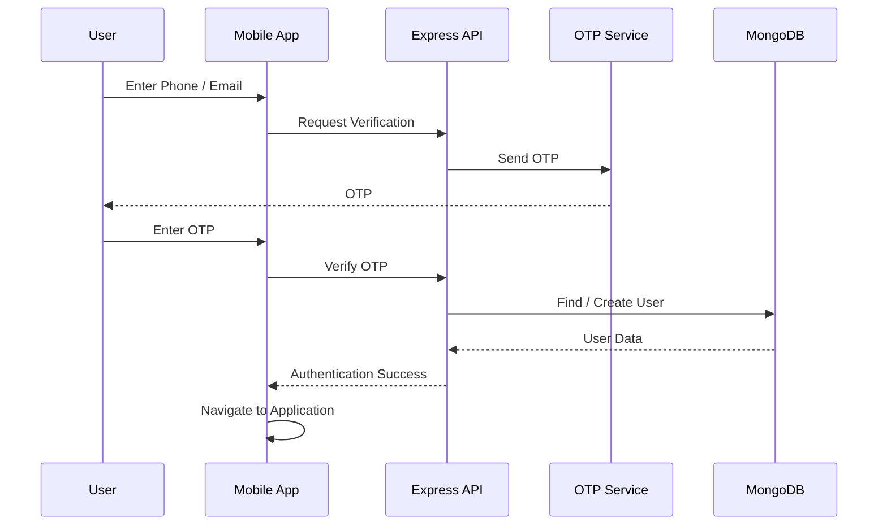

The same verification principle can be applied to driver registration.

---

# Driver Registration

Drivers provide the information required to operate within the platform.

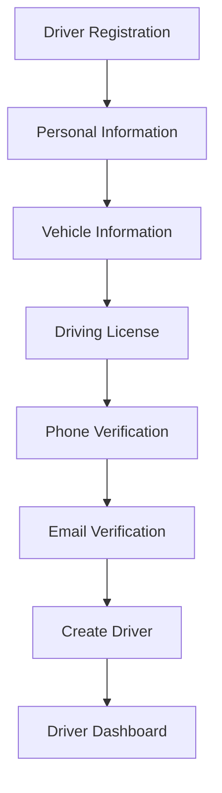

Driver information includes:

* Name
* Country
* Phone number
* Email
* Vehicle type
* Registration number
* Registration date
* Driving license
* Vehicle color
* Driver rate

---

# Driver Communication

Passengers can access the driver's phone number from the ride details.

```text
Passenger
    │
    ▼
Ride Details
    │
    ▼
Call Driver
    │
    ▼
Native Phone Dialer
```

The application delegates the actual phone call to the device's native calling functionality.

---

# Payment

The passenger application includes a payment-method interface as part of the ride-booking experience.

The ride architecture keeps payment information associated with the ride lifecycle so that payment handling can be extended independently.

> If a production payment gateway is added later, it can be integrated into the existing ride/payment layer without redesigning the entire application.

---

# Rating System

After a ride is completed, passengers can provide feedback about the driver.

```text
Ride Completed
      │
      ▼
Rating Screen
      │
      ▼
Passenger Selects Rating
      │
      ▼
Backend Updates Driver Rating
      │
      ▼
Driver Profile
```

The driver profile maintains rating and ride statistics.

---

# Database Architecture

Rawaan uses **MongoDB with Prisma ORM**.

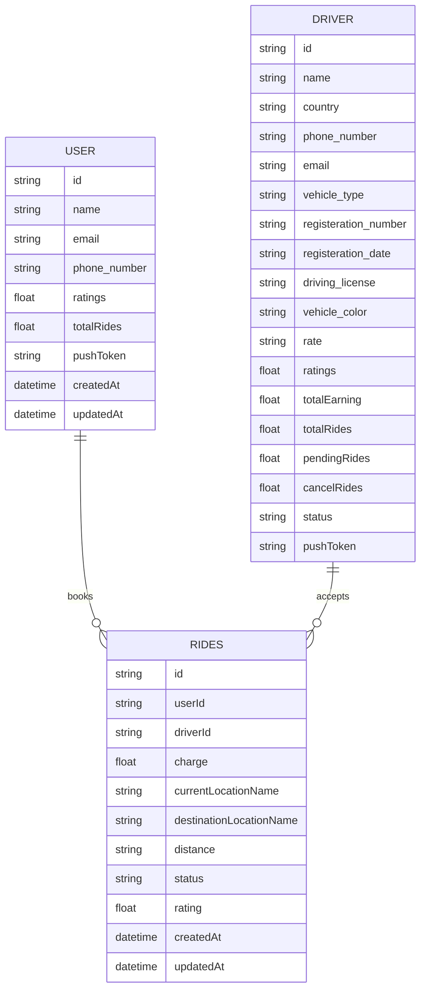

---

# Core Data Models

### User

```text
User
├── id
├── name
├── email
├── phone_number
├── ratings
├── pushToken
├── totalRides
├── createdAt
└── updatedAt
```

### Driver

```text
Driver
├── id
├── name
├── country
├── phone_number
├── email
├── vehicle_type
├── registeration_number
├── registeration_date
├── driving_license
├── vehicle_color
├── rate
├── ratings
├── totalEarning
├── totalRides
├── pendingRides
├── cancelRides
├── status
├── pushToken
├── createdAt
└── updatedAt
```

### Ride

```text
Ride
├── id
├── userId
├── driverId
├── charge
├── currentLocationName
├── destinationLocationName
├── distance
├── status
├── rating
├── createdAt
└── updatedAt
```

---

# Technology Stack

## Mobile

| Technology              | Purpose                                      |
| ----------------------- | -------------------------------------------- |
| React Native            | Cross-platform mobile application            |
| Expo                    | React Native development and build ecosystem |
| Expo Router             | File-based navigation                        |
| TypeScript              | Static type safety                           |
| Axios                   | HTTP API communication                       |
| React Native Maps       | Map rendering                                |
| Expo Location           | Device GPS/location                          |
| WebSocket               | Real-time communication                      |
| Ionicons / Custom Icons | Application UI                               |
| Custom Theme System     | Consistent design system                     |

## Backend

| Technology    | Purpose                 |
| ------------- | ----------------------- |
| Node.js       | JavaScript runtime      |
| Express.js    | REST API framework      |
| TypeScript    | Backend type safety     |
| Prisma        | ORM/database access     |
| MongoDB       | Primary database        |
| WebSocket     | Real-time communication |
| Twilio Verify | Phone verification      |
| Email Service | Email OTP/verification  |

## Mapping

| Technology    | Purpose                   |
| ------------- | ------------------------- |
| MapTiler      | Map tiles                 |
| OpenStreetMap | Map data                  |
| Nominatim     | Location search/geocoding |
| OSRM          | Route calculation         |
| Expo Location | Device GPS                |

---

# High-Level Architecture

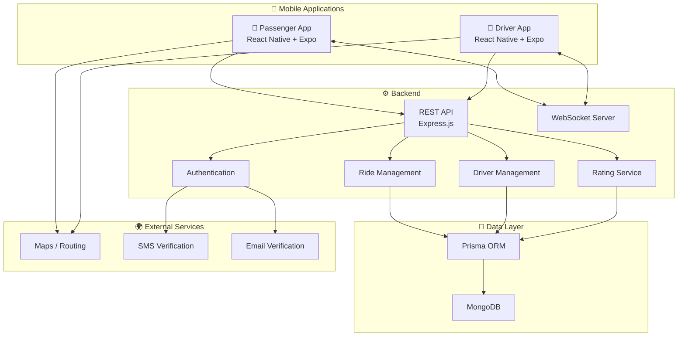

---

# 🧠 Engineering Decisions

## Why React Native?

React Native allows the platform to target Android and iOS while sharing a large portion of the application code.

```text
             React Native
                  │
          ┌───────┴───────┐
          ▼               ▼
       Android           iOS
```

## Why Expo?

Expo simplifies:

* Development
* Native configuration
* Device testing
* Builds
* App distribution

## Why Node.js?

Node.js works well for:

* REST APIs
* Real-time applications
* I/O-heavy workloads
* TypeScript-based backend development

## Why Prisma?

Prisma provides:

* Type-safe database queries
* Schema management
* Cleaner database access
* Better developer experience

## Why MongoDB?

MongoDB provides a flexible document-oriented data model suitable for application data that evolves during development.

## Why WebSockets?

Ride-sharing applications contain information that needs to reach users quickly.

Traditional polling requires:

```text
Client → Request
        ↓
       Wait
        ↓
Client → Request
        ↓
       Wait
        ↓
Client → Request
```

WebSockets provide a persistent communication channel:

```text
Driver
   │
   │ Real-Time Event
   ▼
WebSocket Server
   │
   │ Real-Time Event
   ▼
Passenger
```

This is particularly useful for:

* Driver location updates
* Ride status
* Ride requests
* Driver assignment
* Ride completion

---

# Feature Overview

## Passenger

* [x] Authentication
* [x] OTP verification
* [x] Profile management
* [x] Current location detection
* [x] Location search
* [x] Destination selection
* [x] Route visualization
* [x] Distance calculation
* [x] Fare information
* [x] Ride booking
* [x] Driver assignment
* [x] Driver information
* [x] Driver calling
* [x] Real-time ride status
* [x] Live driver tracking
* [x] Ride progress
* [x] Ride completion
* [x] Driver rating
* [x] Ride history
* [x] Recent rides
* [x] Payment interface

## Driver

* [x] Driver registration
* [x] Vehicle information
* [x] License information
* [x] Driver profile
* [x] Availability management
* [x] Ride request handling
* [x] Ride acceptance
* [x] Ride status updates
* [x] Live location sharing
* [x] Ride completion
* [x] Earnings tracking
* [x] Ride statistics
* [x] Rating management

## Backend

* [x] REST API
* [x] WebSocket communication
* [x] User management
* [x] Driver management
* [x] Ride management
* [x] Prisma ORM
* [x] MongoDB persistence
* [x] Authentication
* [x] OTP verification
* [x] Rating system
* [x] Validation
* [x] Error handling

---

# Security & Validation

The backend is responsible for validating requests before modifying ride or user data.

Important areas include:

* Authentication verification
* Protected API routes
* Request validation
* Ride ownership validation
* Driver assignment validation
* Ride state validation
* Database validation
* Environment-based configuration
* Secure handling of API credentials

Sensitive configuration (database URL, API keys, auth secrets) is kept outside the source code through environment variables — see [Running the Project](#-running-the-project) for the required variables.

---

# Lessons Learned

Building Rawaan provided practical experience in:

### React Native

* Component architecture
* Expo Router
* Mobile navigation
* Native permissions
* Maps
* Device location
* Responsive UI
* Production builds

### Backend Development

* REST API design
* Express controllers
* Authentication
* Validation
* Prisma
* MongoDB
* Error handling

### Real-Time Systems

* WebSocket connections
* Event-driven communication
* Driver location updates
* Ride status synchronization
* Real-time UI updates
* Connection management

### Software Engineering

* Separation of concerns
* API design
* State management
* Database modeling
* Environment configuration
* Debugging
* Mobile/backend integration

---

> 🚕 **Rawaan** — Connecting passengers and drivers through a real-time mobility experience.
